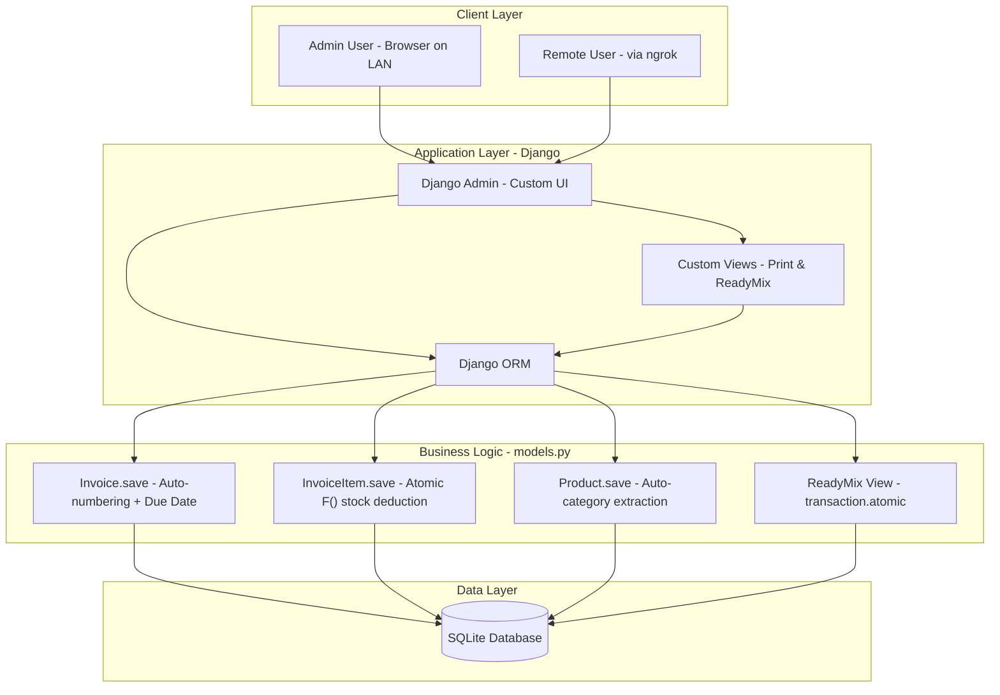
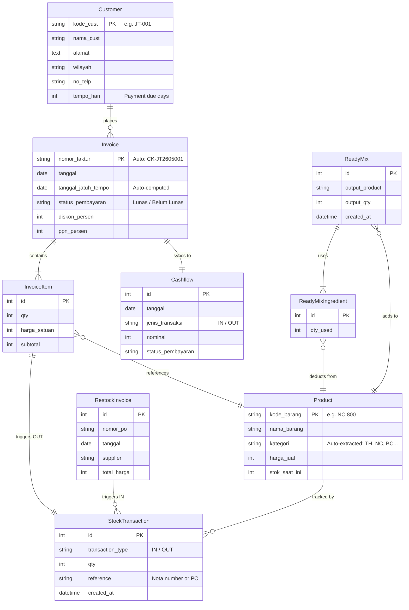

# ColorKing — Django ERP System
### A full-stack inventory & sales management system built for a regional paint distribution business.

> **Case Study Type:** Real-world client project · **Stack:** Django · SQLite · Vanilla JS · HTML/CSS  
> **Domain:** Inventory Management, Sales Invoicing, Manufacturing (Ready Mix), Financial Reporting

---

## 📋 Table of Contents
1. [Business Problem](#-business-problem)
2. [System Architecture](#-system-architecture)
3. [Data Model (ERD)](#-data-model-erd)
4. [Key Engineering Highlights](#-key-engineering-highlights)
5. [Feature Overview](#-feature-overview)
6. [Tech Stack](#-tech-stack)
7. [Deployment](#-deployment)

---

## 🏭 Business Problem

The client is a **regional paint distributor** operating across Central and West Java, Indonesia. They needed to move from managing their business manually with paper notes and spreadsheets to a centralized digital system.

**Core Challenges:**
- Tracking dozens of paint SKUs with different unit measurements (`LTR` for Thinner, `KLG` for cans)
- Preventing overselling when multiple sales happen simultaneously (race condition)
- A "Ready Mix" manufacturing workflow: mixing existing stock to produce a new product
- Generating printable delivery notes (*Surat Jalan*) and invoices (*Nota*) formatted for A5/half-letter paper
- Automatic payment due dates and real-time cashflow tracking per customer

---

## 🏗️ System Architecture

The system follows a standard **monolithic Django MVC pattern**, deployed locally on the client's Windows machine and accessible over LAN via `0.0.0.0:8000`. Public access (for remote monitoring) is achieved via an **ngrok tunnel**.



---

## 🗂️ Data Model (ERD)



---

## ⚙️ Key Engineering Highlights

### 1. Race Condition Prevention — Atomic Stock Deduction
The most critical risk in any inventory system is two users simultaneously selling the last unit of stock. This system solves it with two layers of protection.

**Layer 1: `select_for_update()` on Invoice numbering** — Prevents two invoices from getting the same number if created within the same second.
```python
# sales/models.py — Invoice.save()
last_invoice = (
    Invoice.objects
    .select_for_update()   # Locks the row in the DB until transaction ends
    .filter(nomor_faktur__startswith=prefix)
    .order_by('-nomor_faktur')
    .first()
)
```

**Layer 2: `F()` expression on stock deduction** — Instead of `product.stock = product.stock - qty` (which reads the old value into Python memory and is vulnerable to race conditions), we use a single database-level UPDATE.
```python
# sales/models.py — InvoiceItem.save()
Product.objects.filter(pk=self.product.pk).update(
    stok_saat_ini=F('stok_saat_ini') - self.qty  # Atomic at DB level
)
```

---

### 2. Manufacturing Module — Ready Mix
The Ready Mix feature allows staff to combine existing stock components to manufacture a new finished product. The entire operation is wrapped in `transaction.atomic()` so if any step fails (e.g., insufficient stock for one ingredient), **all stock changes are rolled back** completely.

```python
# sales/views.py — create_readymix()
with transaction.atomic():
    for ingredient in ingredients:
        Product.objects.filter(pk=ingredient.pk).update(
            stok_saat_ini=F('stok_saat_ini') - qty_used
        )
        StockTransaction.objects.create(type='OUT', ...)

    Product.objects.filter(pk=output_product.pk).update(
        stok_saat_ini=F('stok_saat_ini') + output_qty
    )
    StockTransaction.objects.create(type='IN', ...)
```

---

### 3. Single Source of Truth — Stock Ledger
Every single stock movement — whether from a sale, a restock PO, or a Ready Mix batch — is recorded in the `StockTransaction` table. The `stok_saat_ini` field is always a **derived value** that can be recalculated from the ledger at any time.

```python
# Product.update_stock_from_history() — Recalculates absolute stock from ledger
total_in  = self.transactions.filter(type='IN').aggregate(Sum('qty'))['qty__sum'] or 0
total_out = self.transactions.filter(type='OUT').aggregate(Sum('qty'))['qty__sum'] or 0
real_stock = total_in - total_out
```

---

### 4. Auto-Category Extraction with Regex
The system automatically categorizes products from their SKU code using a regex at save time. This powers the dynamic unit display on printed documents (`LTR` for Thinner, `KLG` for cans).

```python
# Product.save()
match = re.search(r'^([A-Za-z]+)', str(self.kode_barang))
if match:
    self.kategori = match.group(1).upper()  # "TH 500" → "TH"
```

Then in the print template:
```django
{{ item.qty }} LTRKLG
```

---

### 5. Cashflow Auto-Sync
Every time an invoice is saved, edited, or has items added/removed, a `Cashflow` record is automatically created or updated via `update_or_create()`, ensuring the financial dashboard is **always in sync** without any manual data entry.

```python
# Invoice.sync_cashflow() — called from Invoice.save() and InvoiceItem.save()/delete()
Cashflow.objects.update_or_create(
    invoice=self,
    defaults={'nominal': grand_total, 'status_pembayaran': cashflow_status, ...}
)
```

---

## ✨ Feature Overview

| Feature | Description |
|---|---|
| **Invoice Management** | Create, edit, and print invoices with auto-generated sequential numbering (e.g., `CK-JT2605001`) |
| **Inventory Tracking** | Real-time stock levels with full audit trail via `StockTransaction` ledger |
| **Ready Mix Manufacturing** | Combine stock components atomically to produce new products |
| **Restock Invoices** | Track purchase orders from suppliers, automatically incrementing stock |
| **Customer Profiles** | Per-customer payment terms, invoice history, and running total |
| **Cashflow Dashboard** | Automatic income tracking per invoice, with Lunas/Belum Lunas status |
| **Print Templates** | A5/half-letter formatted *Nota* (invoice) and *Surat Jalan* (delivery note) for printing |
| **Dynamic Grand Total** | Invoice list view shows a live sum card that recalculates as filters are applied |
| **Global Filter Toggle** | Floating button to hide/show the admin sidebar filter, with `localStorage` persistence |
| **Import/Export** | Bulk Customer and Product import via CSV/Excel using `django-import-export` |

---

## 🛠️ Tech Stack

| Layer | Technology |
|---|---|
| **Backend Framework** | Django 4.x |
| **Database** | SQLite (local deployment) |
| **Admin UI** | Django Admin (heavily customized with custom templates & `Media` CSS) |
| **Frontend** | Vanilla HTML/CSS/JS, Select2 (searchable dropdowns) |
| **Print Layout** | CSS `@page` rules, Flexbox (pixel-perfect A5/half-letter output) |
| **Data Import** | `django-import-export` |
| **Date Filters** | `django-admin-rangefilter` |
| **Public Tunnel** | ngrok (for remote access over LAN) |

---

## 🚀 Deployment

The application is designed for **local LAN deployment** on the client's Windows machine, with all other devices on the same WiFi network accessing it via the host's IP.

```bash
# 1. Clone and set up virtual environment
git clone https://github.com/rafihw42/django-erp-system-architecture.git
cd django-erp-system-architecture
python -m venv .venv
.venv\Scripts\activate

# 2. Install dependencies
pip install -r requirements.txt

# 3. Initialize the database
python manage.py migrate

# 4. Create admin user
python manage.py createsuperuser

# 5. Run server (accessible on LAN)
python manage.py runserver 0.0.0.0:8000
```

Access the admin panel at `http://localhost:8000/admin/` or from other devices on the same network at `http://<host-ip>:8000/admin/`.

---

*Built as a commissioned project for a paint distribution business in West Java, Indonesia.*
